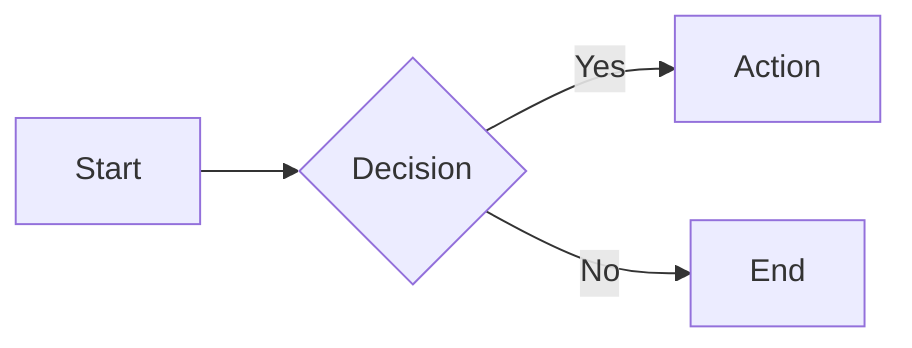
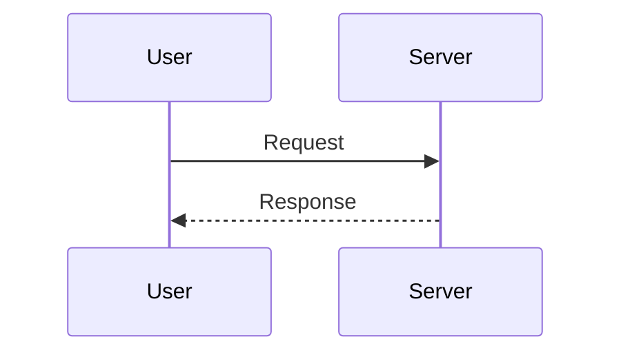
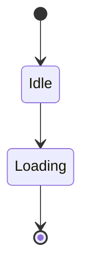
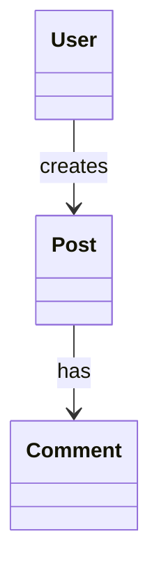
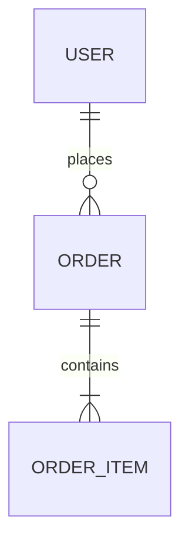

# Pretty Mermaid

Render stunning, professionally-styled Mermaid diagrams with one command. Supports SVG for web/docs and ASCII for terminals.

## Quick Start

### Render a Single Diagram

**From a file:**
```bash
node scripts/render.mjs \
  --input diagram.mmd \
  --output diagram.svg \
  --format svg \
  --theme tokyo-night
```

**From user-provided Mermaid code:**
1. Save the code to a `.mmd` file
2. Run the render script with desired theme

### Batch Render Multiple Diagrams

```bash
node scripts/batch.mjs \
  --input-dir ./diagrams \
  --output-dir ./output \
  --format svg \
  --theme dracula \
  --workers 4
```

### ASCII Output (Terminal-Friendly)

```bash
node scripts/render.mjs \
  --input diagram.mmd \
  --format ascii \
  --use-ascii
```

---

## Workflow Decision Tree

**Step 1: What does the user want?**
- **Render existing Mermaid code** → Go to [Rendering](#rendering-diagrams)
- **Create new diagram** → Go to [Creating](#creating-diagrams)
- **Apply/change theme** → Go to [Theming](#theming)
- **Batch process** → Go to [Batch Rendering](#batch-rendering)

**Step 2: Choose output format**
- **SVG** (web, docs, presentations) → `--format svg`
- **ASCII** (terminal, logs, plain text) → `--format ascii`

**Step 3: Select theme**
- **Dark mode docs** → `tokyo-night` (recommended)
- **Light mode docs** → `github-light`
- **Vibrant colors** → `dracula`
- **See all themes** → Run `node scripts/themes.mjs`

---

## Rendering Diagrams

### From File

When user provides a `.mmd` file or Mermaid code block:

1. **Save to file** (if code block):
   ```bash
   cat > diagram.mmd << 'EOF'
   flowchart LR
       A[Start] --> B[End]
   EOF
   ```

2. **Render with theme**:
   ```bash
   node scripts/render.mjs \
     --input diagram.mmd \
     --output diagram.svg \
     --theme tokyo-night
   ```

3. **Verify output**:
   - SVG: Open in browser or embed in docs
   - ASCII: Display in terminal

### Output Formats

**SVG (Scalable Vector Graphics)**
- Best for: Web pages, documentation, presentations
- Features: Full color support, transparency, scalable
- Usage: `--format svg --output diagram.svg`

**ASCII (Terminal Art)**
- Best for: Terminal output, plain text logs, README files
- Features: Pure text, works anywhere, no dependencies
- Usage: `--format ascii` (prints to stdout)
- Options:
  - `--use-ascii` - Use pure ASCII (no Unicode)
  - `--padding-x 5` - Horizontal spacing
  - `--padding-y 5` - Vertical spacing

### Advanced Options

**Custom Colors** (overrides theme):
```bash
node scripts/render.mjs \
  --input diagram.mmd \
  --bg "#1a1b26" \
  --fg "#a9b1d6" \
  --accent "#7aa2f7" \
  --output custom.svg
```

**Transparent Background**:
```bash
node scripts/render.mjs \
  --input diagram.mmd \
  --transparent \
  --output transparent.svg
```

**Custom Font**:
```bash
node scripts/render.mjs \
  --input diagram.mmd \
  --font "JetBrains Mono" \
  --output custom-font.svg
```

---

## Creating Diagrams

### Using Templates

**Step 1: List available templates**
```bash
ls assets/example_diagrams/
# flowchart.mmd  sequence.mmd  state.mmd  class.mmd  er.mmd
```

**Step 2: Copy and modify**
```bash
cp assets/example_diagrams/flowchart.mmd my-workflow.mmd
# Edit my-workflow.mmd with user requirements
```

**Step 3: Render**
```bash
node scripts/render.mjs \
  --input my-workflow.mmd \
  --output my-workflow.svg \
  --theme github-dark
```

### Diagram Type Reference

For detailed syntax and best practices, see [DIAGRAM_TYPES.md](references/DIAGRAM_TYPES.md).

**Quick reference:**

**Flowchart** - Processes, workflows, decision trees


**Sequence** - API calls, interactions, message flows


**State** - Application states, lifecycle, FSM


**Class** - Object models, architecture, relationships


**ER** - Database schema, data models


### From User Requirements

**Step 1: Identify diagram type**
- **Process/workflow** → Flowchart
- **API/interaction** → Sequence
- **States/lifecycle** → State
- **Object model** → Class
- **Database** → ER

**Step 2: Create diagram file**
```bash
cat > user-diagram.mmd << 'EOF'
# [Insert generated Mermaid code]
EOF
```

**Step 3: Render and iterate**
```bash
node scripts/render.mjs \
  --input user-diagram.mmd \
  --output preview.svg \
  --theme tokyo-night

# Review with user, edit diagram.mmd if needed, re-render
```

---

## Theming

### List Available Themes

```bash
node scripts/themes.mjs
```

**Output:**
```
Available Beautiful-Mermaid Themes:

 1. zinc-light
 2. zinc-dark
 3. tokyo-night
 4. tokyo-night-storm
 5. tokyo-night-light
 6. catppuccin-mocha
 7. catppuccin-latte
 8. nord
 9. nord-light
10. dracula
11. github-dark
12. github-light
13. solarized-dark
14. solarized-light
15. one-dark

Total: 15 themes
```

### Theme Selection Guide

**For dark mode documentation:**
- `tokyo-night` ⭐ - Modern, developer-friendly
- `github-dark` - Familiar GitHub style
- `dracula` - Vibrant, high contrast
- `nord` - Cool, minimalist

**For light mode documentation:**
- `github-light` - Clean, professional
- `zinc-light` - High contrast, printable
- `catppuccin-latte` - Warm, friendly

**Detailed theme information:** See [THEMES.md](references/THEMES.md)

### Apply Theme to Diagram

```bash
node scripts/render.mjs \
  --input diagram.mmd \
  --output themed.svg \
  --theme tokyo-night
```

### Compare Themes

Render the same diagram with multiple themes:
```bash
for theme in tokyo-night dracula github-dark; do
  node scripts/render.mjs \
    --input diagram.mmd \
    --output "diagram-${theme}.svg" \
    --theme "$theme"
done
```

---

## Batch Rendering

### Batch Render Directory

**Step 1: Organize diagrams**
```bash
diagrams/
├── architecture.mmd
├── workflow.mmd
└── database.mmd
```

**Step 2: Batch render**
```bash
node scripts/batch.mjs \
  --input-dir ./diagrams \
  --output-dir ./rendered \
  --format svg \
  --theme tokyo-night \
  --workers 4
```

**Output:**
```
Found 3 diagram(s) to render...
✓ architecture.mmd
✓ workflow.mmd
✓ database.mmd

3/3 diagrams rendered successfully
```

### Batch with Multiple Formats

Render both SVG and ASCII:
```bash
# SVG for docs
node scripts/batch.mjs \
  --input-dir ./diagrams \
  --output-dir ./svg \
  --format svg \
  --theme github-dark

# ASCII for README
node scripts/batch.mjs \
  --input-dir ./diagrams \
  --output-dir ./ascii \
  --format ascii \
  --use-ascii
```

### Performance Options

- `--workers N` - Parallel rendering (default: 4)
- Recommended: `--workers 8` for 10+ diagrams

---

## Common Use Cases

### 1. Architecture Diagram for Documentation

```bash
# User provides architecture description
# → Create flowchart.mmd
# → Render with professional theme

node scripts/render.mjs \
  --input architecture.mmd \
  --output docs/architecture.svg \
  --theme github-dark \
  --transparent
```

### 2. API Sequence Diagram

```bash
# User describes API flow
# → Create sequence.mmd
# → Render with clear theme

node scripts/render.mjs \
  --input api-flow.mmd \
  --output api-sequence.svg \
  --theme tokyo-night
```

### 3. Database Schema Visualization

```bash
# User provides table definitions
# → Create er.mmd
# → Render for database docs

node scripts/render.mjs \
  --input schema.mmd \
  --output database-schema.svg \
  --theme dracula
```

### 4. Terminal-Friendly Workflow

```bash
# For README or terminal display
node scripts/render.mjs \
  --input workflow.mmd \
  --format ascii \
  --use-ascii > workflow.txt
```

### 5. Presentation Slides

```bash
# High-contrast for projectors
node scripts/render.mjs \
  --input slides-diagram.mmd \
  --output presentation.svg \
  --theme zinc-light
```

---

## Troubleshooting

### beautiful-mermaid Not Installed
```
Error: Cannot find module 'beautiful-mermaid'
```
**Note:** This should auto-install on first run. If it fails:
```bash
cd /path/to/pretty-mermaid-skill && npm install
```

### Invalid Mermaid Syntax
```
Error: Parse error on line 3
```
**Solution:**
1. Validate syntax against [DIAGRAM_TYPES.md](references/DIAGRAM_TYPES.md)
2. Test on https://mermaid.live/
3. Check for common errors:
   - Missing spaces in `A --> B`
   - Incorrect node shape syntax
   - Unclosed brackets

### File Not Found
```
Error: Input file not found: diagram.mmd
```
**Solution:** Verify file path is correct, use absolute path if needed

---

## Resources

### scripts/
Executable Node.js scripts for rendering operations:
- `render.mjs` - Main rendering script
- `batch.mjs` - Batch processing script
- `themes.mjs` - Theme listing utility

### references/
Documentation to inform diagram creation:
- `THEMES.md` - Detailed theme reference with examples
- `DIAGRAM_TYPES.md` - Comprehensive syntax guide for all diagram types
- `api_reference.md` - beautiful-mermaid API documentation

### assets/
Template files for quick diagram creation:
- `example_diagrams/flowchart.mmd` - Flowchart template
- `example_diagrams/sequence.mmd` - Sequence diagram template
- `example_diagrams/state.mmd` - State diagram template
- `example_diagrams/class.mmd` - Class diagram template
- `example_diagrams/er.mmd` - ER diagram template

---

## Tips & Best Practices

### Performance
- Batch render for 3+ diagrams (parallel processing)
- Keep diagrams under 50 nodes for fast rendering
- Use ASCII for quick previews

### Quality
- Use `tokyo-night` or `github-dark` for technical docs
- Add transparency for dark/light mode compatibility: `--transparent`
- Test theme in target environment before batch rendering

### Workflow
1. Start with templates from `assets/example_diagrams/`
2. Iterate with user feedback
3. Apply theme last
4. Render both SVG (docs) and ASCII (README) if needed

### Accessibility
- Use high-contrast themes for presentations
- Add text labels to all connections
- Avoid color-only information encoding
