# Mermaid Diagram Types Reference

## Flowchart / Graph

### Basic Syntax
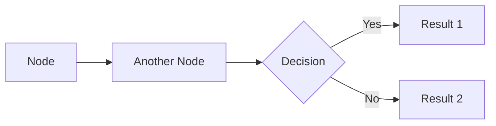

### Node Shapes
- `[Text]` - Rectangle
- `([Text])` - Stadium (rounded)
- `[[Text]]` - Subroutine (double border)
- `[(Text)]` - Cylindrical (database)
- `((Text))` - Circle
- `>Text]` - Asymmetric shape
- `{Text}` - Rhombus (decision)
- `{{Text}}` - Hexagon
- `[/Text/]` - Parallelogram
- `[\Text\]` - Trapezoid (alt)

### Connections
- `-->` - Arrow
- `---` - Line
- `-.->` - Dotted arrow
- `==>` - Thick arrow
- `--text-->` - Arrow with text
- `-->|text|` - Arrow with text (alt syntax)

### Direction
- `LR` - Left to Right
- `RL` - Right to Left
- `TB` / `TD` - Top to Bottom / Top Down
- `BT` - Bottom to Top

### Best Practices
- Use `LR` direction for wide screens
- Keep decision nodes distinct with `{}` shape
- Use stadium shapes `([])` for start/end
- Limit nesting depth to 3 levels
- Group related nodes visually

---

## Sequence Diagram

### Basic Syntax
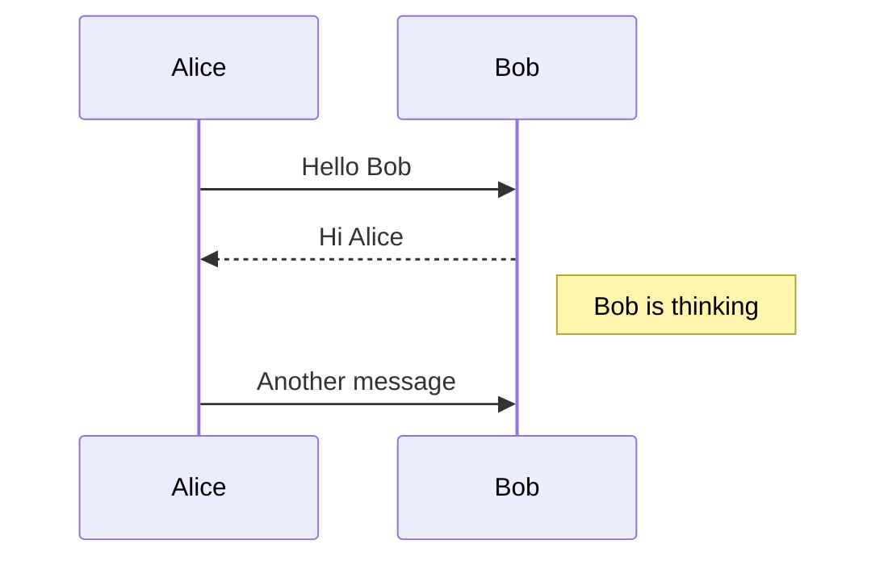

### Participants
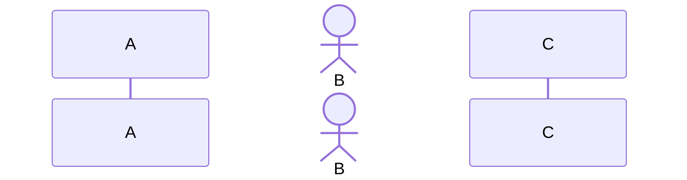

### Message Types
- `->>` - Solid line arrow
- `-->>` - Dotted line arrow
- `-x` - Solid line with cross
- `--x` - Dotted line with cross
- `-)` - Solid line with open arrow
- `--)` - Dotted line with open arrow

### Activations
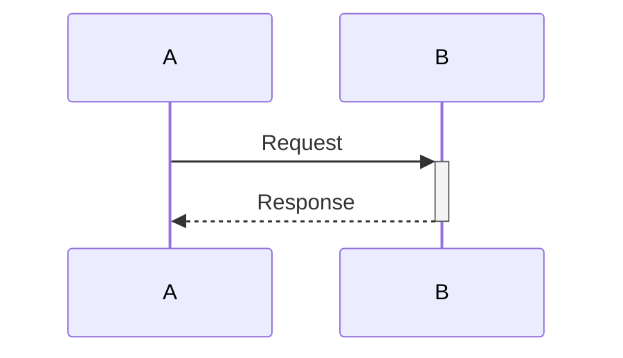

### Notes
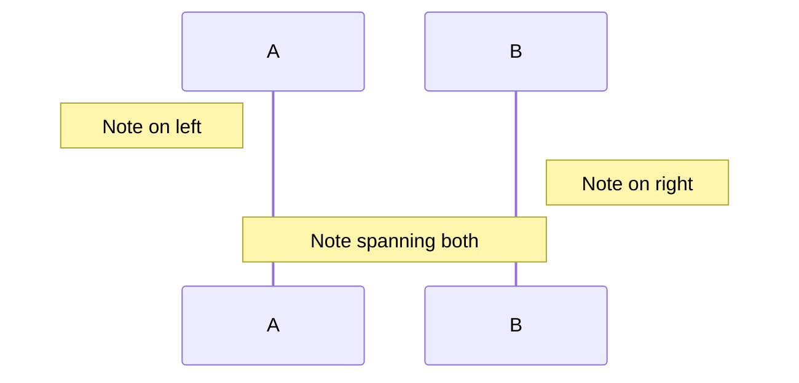

### Loops & Alt
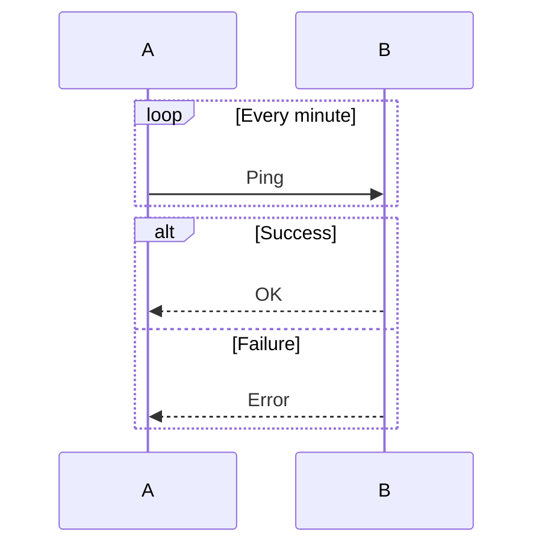

### Best Practices
- Use meaningful participant names
- Add notes for complex logic
- Keep sequence linear (avoid too many branches)
- Use activations to show processing time
- Limit to 5-7 participants for clarity

---

## State Diagram

### Basic Syntax
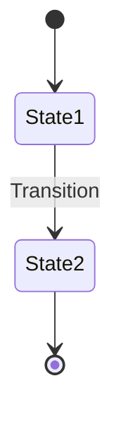

### Composite States
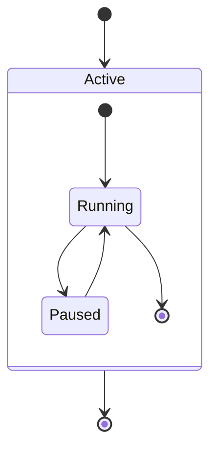

### Choice
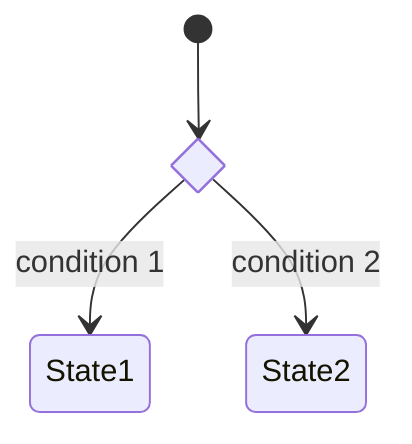

### Concurrency
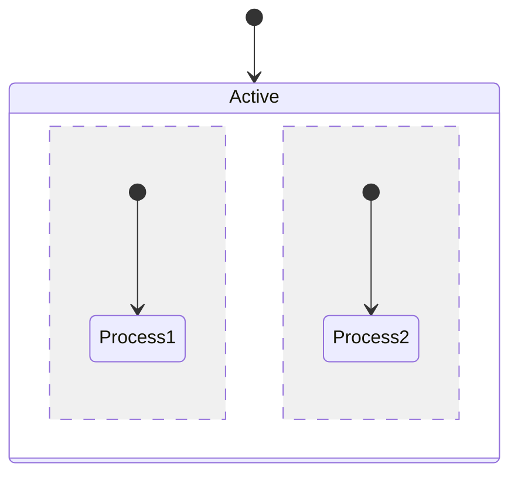

### Notes
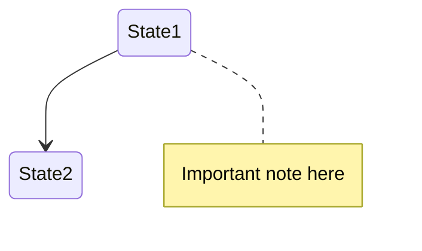

### Best Practices
- Start with `[*]` for initial state
- Use clear transition labels
- Limit composite state depth to 2 levels
- Group related states together
- Use choice nodes for complex branching

---

## Class Diagram

### Basic Syntax
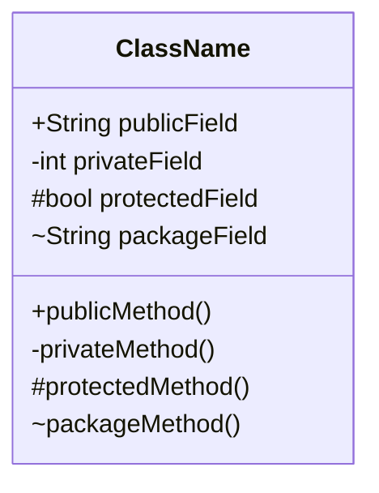

### Visibility
- `+` Public
- `-` Private
- `#` Protected
- `~` Package/Internal

### Relationships
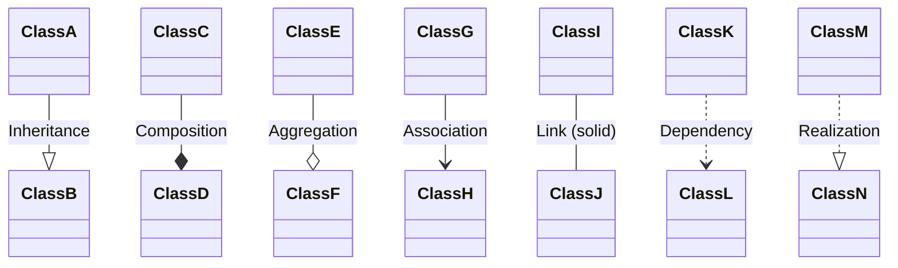

### Cardinality
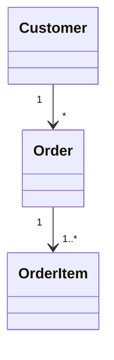

### Abstract & Interface
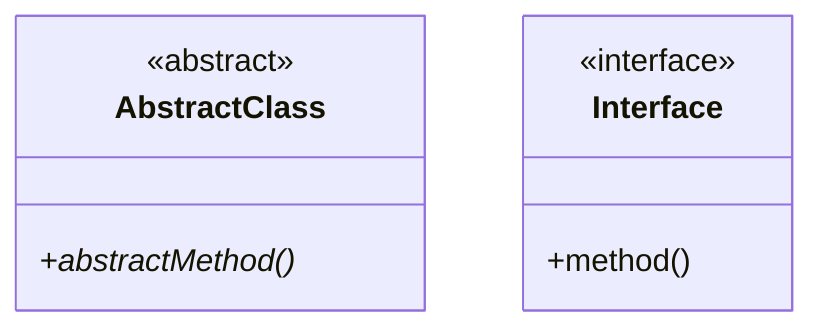

### Best Practices
- Show only relevant attributes/methods
- Use inheritance sparingly
- Indicate cardinality on associations
- Group related classes visually
- Use interfaces for contracts

---

## ER Diagram

### Basic Syntax
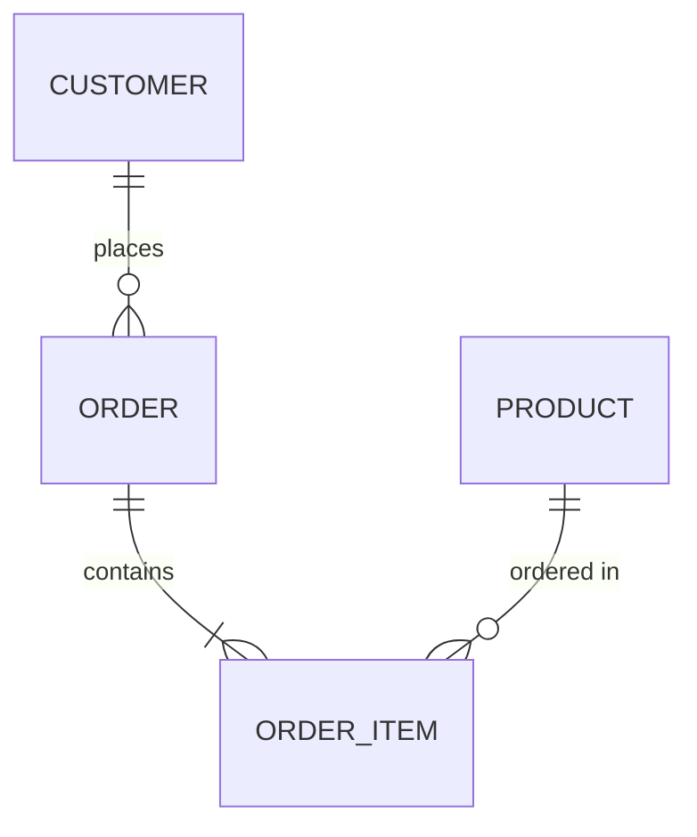

### Cardinality
- `||--||` - One to one
- `}o--o{` - Zero or more to zero or more
- `||--o{` - One to zero or more
- `}o--||` - Zero or more to one
- `||--|{` - One to one or more
- `}|--|{` - One or more to one or more

### Attributes
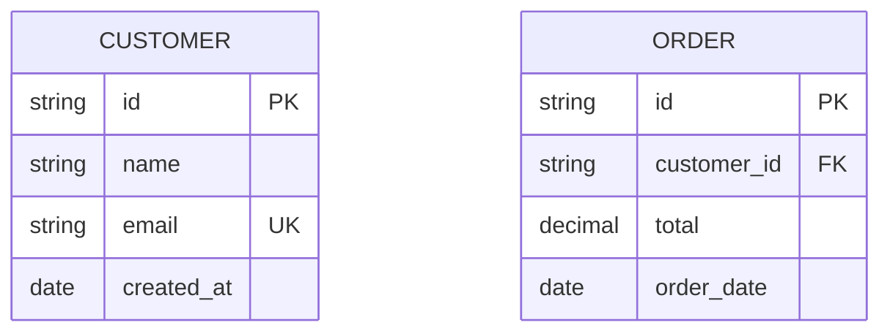

### Attribute Types
- Use standard SQL types: `string`, `int`, `decimal`, `date`, `bool`
- Add constraints: `PK` (Primary Key), `FK` (Foreign Key), `UK` (Unique Key)

### Best Practices
- Use UPPERCASE for entity names
- Use snake_case for attribute names
- Always mark PK and FK
- Show only essential attributes
- Keep relationship labels clear
- Limit to 6-8 entities per diagram

---

## General Best Practices

### Theming
- Use `tokyo-night` for dark mode documentation
- Use `github-light` for light mode documentation
- Use `dracula` for vibrant, colorful diagrams
- Use `monokai` for code-centric diagrams

### Performance
- Keep diagrams under 50 nodes for fast rendering
- Split complex diagrams into multiple files
- Use batch rendering for multiple diagrams

### Accessibility
- Add meaningful labels to all connections
- Use high-contrast themes
- Avoid relying solely on color to convey information
- Provide text descriptions for complex diagrams

### File Organization
```
diagrams/
├── architecture/
│   ├── system-overview.mmd
│   └── data-flow.mmd
├── workflows/
│   ├── user-registration.mmd
│   └── checkout-process.mmd
└── database/
    ├── schema-users.mmd
    └── schema-orders.mmd
```
