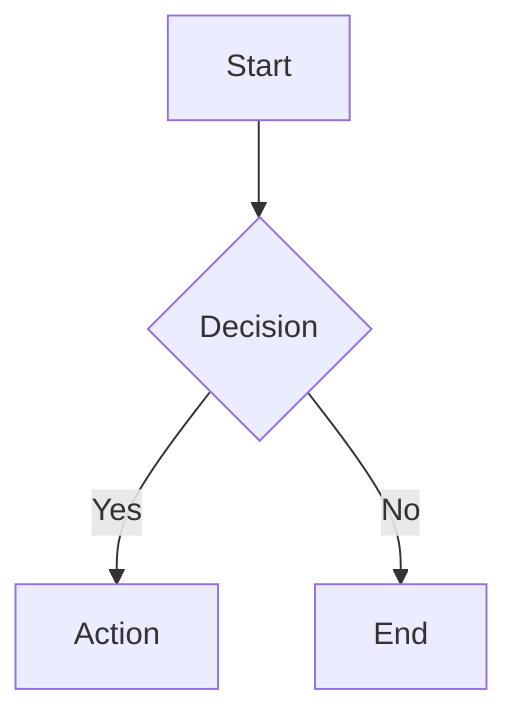

# Beautiful-Mermaid 主题参考

Beautiful-Mermaid 提供 15 个精心设计的内置主题，涵盖亮色和暗色方案。每个主题都基于两种核心颜色（背景 `bg` 和前景 `fg`），并可通过可选的丰富色彩进行增强。

## 快速选择指南

### 亮色主题
| 主题 | 背景 | 前景 | 用途 |
|------|------|------|------|
| `zinc-light` | #FFFFFF | 自动推导 | 通用亮色主题 |
| `tokyo-night-light` | #d5d6db | #34548a | 柔和亮色 |
| `catppuccin-latte` | #eff1f5 | #8839ef | 清爽亮色 |
| `nord-light` | #eceff4 | #5e81ac | 冰蓝亮色 |
| `github-light` | #ffffff | #0969da | GitHub 亮色风格 |
| `solarized-light` | #fdf6e3 | #268bd2 | Solarized 亮色 |

### 暗色主题
| 主题 | 背景 | 前景 | 用途 |
|------|------|------|------|
| `zinc-dark` | #18181B | 自动推导 | 通用暗色主题 |
| `tokyo-night` | #1a1b26 | #a9b1d6 | 现代日本风格 |
| `tokyo-night-storm` | #24283b | #a9b1d6 | Tokyo Night 变体 |
| `catppuccin-mocha` | #1e1e2e | #cba6f7 | 温暖暗色 |
| `nord` | #2e3440 | 自动推导 | 北欧冰蓝风格 |
| `dracula` | #282a36 | #f8f8f2 | 经典暗色主题 |
| `github-dark` | #0d1117 | #4493f8 | GitHub 暗色风格 |
| `solarized-dark` | #002b36 | #268bd2 | Solarized 暗色 |
| `one-dark` | #282c34 | 自动推导 | Atom One Dark 风格 |

---

## 主题详细说明

### `zinc-light` (亮色)
**特性：** 清洁、通用的浅色主题，适合打印和高对比度场景。

**配置：**
```javascript
{
  bg: '#FFFFFF',
  fg: '#27272A'
}
```

**最佳用途：**
- 正式文档和报告
- 打印输出
- 演示幻灯片

**示例：**


---

### `zinc-dark` (暗色)
**特性：** 纯暗色主题，前景色由系统推导。极简主义风格。

**配置：**
```javascript
{
  bg: '#18181B',
  fg: '自动推导'
}
```

**最佳用途：**
- 终端应用
- 暗色 UI 集成
- 代码编辑器

---

### `tokyo-night` (暗色) ⭐ 推荐
**特性：** 现代日本风格，柔和的蓝色调，专为开发者设计。

**配置：**
```javascript
{
  bg: '#1a1b26',
  fg: '#a9b1d6',
  accent: '#7aa2f7'
}
```

**最佳用途：**
- 现代开发文档
- AI 辅助编程
- 代码示例和教程

**视觉特性：**
- 深蓝色背景（#1a1b26）
- 柔和紫色文字（#a9b1d6）
- 亮蓝色强调（#7aa2f7）

---

### `tokyo-night-storm` (暗色)
**特性：** Tokyo Night 的深色变体，更深的背景色。

**配置：**
```javascript
{
  bg: '#24283b',
  fg: '#a9b1d6',
  accent: '#7aa2f7'
}
```

**最佳用途：**
- 极低光环境
- OLED 屏幕优化
- 长时间阅读

---

### `tokyo-night-light` (亮色)
**特性：** Tokyo Night 的亮色版本，保持同样的配色哲学。

**配置：**
```javascript
{
  bg: '#d5d6db',
  fg: '#34548a'
}
```

**最佳用途：**
- 日间使用
- 高对比度需求
- 打印友好

---

### `catppuccin-mocha` (暗色)
**特性：** 温暖、舒适的暗色主题，带有红紫色强调。

**配置：**
```javascript
{
  bg: '#1e1e2e',
  fg: '#cba6f7'
}
```

**最佳用途：**
- 长时间阅读（眼睛友好）
- 创意项目
- 设计文档

---

### `catppuccin-latte` (亮色)
**特性：** Catppuccin 的亮色变体，温暖而柔和。

**配置：**
```javascript
{
  bg: '#eff1f5',
  fg: '#8839ef'
}
```

**最佳用途：**
- 日间亮色环境
- 紫色爱好者
- 设计导向的文档

---

### `nord` (暗色)
**特性：** 北欧启发的冰蓝色调，专业且冷静。

**配置：**
```javascript
{
  bg: '#2e3440',
  fg: '自动推导'
}
```

**最佳用途：**
- 企业文档
- 技术规范
- 系统架构图

**视觉特性：**
- 深灰蓝色背景
- 高对比度文字
- 冷色调整体

---

### `nord-light` (亮色)
**特性：** Nord 的亮色版本。

**配置：**
```javascript
{
  bg: '#eceff4',
  fg: '#5e81ac'
}
```

**最佳用途：**
- 日间亮色使用
- 印刷品
- 北欧风格项目

---

### `dracula` (暗色) ⭐ 推荐
**特性：** 经典的深暗色主题，高对比度。

**配置：**
```javascript
{
  bg: '#282a36',
  fg: '#f8f8f2'
}
```

**最佳用途：**
- 代码编辑器集成
- 开发者文档
- 命令行工具

**视觉特性：**
- 极深的背景色
- 明亮的文字
- 紫色和粉色强调

---

### `github-light` (亮色)
**特性：** GitHub 亮色主题，Web 友好。

**配置：**
```javascript
{
  bg: '#ffffff',
  fg: '#0969da'
}
```

**最佳用途：**
- GitHub README
- Web 文档
- 在线教程

---

### `github-dark` (暗色)
**特性：** GitHub 暗色主题，GitHub 用户熟悉。

**配置：**
```javascript
{
  bg: '#0d1117',
  fg: '#4493f8'
}
```

**最佳用途：**
- GitHub 文档
- GitHub Issues 和 Discussions
- 开源项目

---

### `solarized-light` (亮色)
**特性：** Ethan Schoonover 设计的经典亮色主题。

**配置：**
```javascript
{
  bg: '#fdf6e3',
  fg: '#268bd2'
}
```

**最佳用途：**
- 研究论文
- 学术文档
- 精确色彩工作

---

### `solarized-dark` (暗色)
**特性：** Solarized 的暗色版本，精心调校的对比度。

**配置：**
```javascript
{
  bg: '#002b36',
  fg: '#268bd2'
}
```

**最佳用途：**
- 长篇文档阅读
- 科学论文
- 编程教材

---

### `one-dark` (暗色)
**特性：** Atom 编辑器的经典 One Dark 主题。

**配置：**
```javascript
{
  bg: '#282c34',
  fg: '自动推导'
}
```

**最佳用途：**
- Atom 用户
- JavaScript 项目
- Web 开发文档

---

## 自定义主题

### 基础自定义（Mono Mode）

只需要两种颜色就能创建美观的主题：

```python
python render_mermaid.py \
  --input diagram.mmd \
  --output output.svg \
  --bg '#0f0f0f' \
  --fg '#e0e0e0'
```

系统会自动推导所有其他颜色。

### 高级自定义（Enriched Mode）

对于更丰富的颜色方案，提供可选的强调色：

```python
python render_mermaid.py \
  --input diagram.mmd \
  --output output.svg \
  --bg '#0f0f0f' \
  --fg '#e0e0e0' \
  --accent '#ff6b6b' \
  --muted '#666666' \
  --line '#4a90e2' \
  --surface '#1a1a1a' \
  --border '#2a2a2a'
```

### 颜色选择指南

| 参数 | 作用 | 示例 |
|------|------|------|
| `--bg` | 背景色（必需） | `#1a1a1a` |
| `--fg` | 文字色（必需） | `#e0e0e0` |
| `--accent` | 箭头头和强调 | `#7aa2f7` |
| `--muted` | 次级文字和标签 | `#666666` |
| `--line` | 边/连接线 | `#3d59a1` |
| `--surface` | 节点填充 | `#292e42` |
| `--border` | 节点边框 | `#3d59a1` |

---

## 主题选择决策树

```
你想要的主题风格是什么？
├── 亮色 (Light)
│   ├── 极简/清洁？ → zinc-light
│   ├── GitHub 风格？ → github-light
│   ├── Solarized？ → solarized-light
│   ├── 冰蓝色？ → nord-light
│   ├── 紫色？ → catppuccin-latte
│   └── 柔和日式？ → tokyo-night-light
│
└── 暗色 (Dark)
    ├── 推荐通用？ → tokyo-night ⭐
    ├── 经典暗色？ → dracula ⭐
    ├── 极简/纯粹？ → zinc-dark
    ├── 北欧风格？ → nord
    ├── 温暖舒适？ → catppuccin-mocha
    ├── GitHub 风格？ → github-dark
    ├── 极深背景？ → tokyo-night-storm
    ├── 学术/精确？ → solarized-dark
    └── Atom 风格？ → one-dark
```

---

## 实用示例

### 示例 1：在中文文档中使用 Tokyo Night

```bash
python render_mermaid.py \
  --input 架构图.mmd \
  --output 架构图.svg \
  --theme tokyo-night
```

### 示例 2：创建打印友好的图表

```bash
python render_mermaid.py \
  --input diagram.mmd \
  --output diagram.svg \
  --theme zinc-light
```

### 示例 3：批量应用主题

```bash
python batch_render.py \
  --input-dir ./diagrams \
  --output-dir ./output \
  --format svg \
  --theme dracula
```

### 示例 4：自定义企业主题

```bash
python render_mermaid.py \
  --input diagram.mmd \
  --output output.svg \
  --bg '#1a1a1a' \
  --fg '#ffffff' \
  --accent '#0066cc' \
  --border '#333333'
```

---

## 颜色值速查表

### 常用十六进制颜色
| 颜色名 | 十六进制 | 用途 |
|--------|---------|------|
| 纯白 | #FFFFFF | 亮色背景 |
| 纯黑 | #000000 | 深色背景 |
| 深灰 | #1a1a1a | 友好暗色 |
| 浅灰 | #f0f0f0 | 友好亮色 |
| 蓝色 | #0066cc | 强调色 |
| 绿色 | #00cc00 | 成功色 |
| 红色 | #cc0000 | 警告/错误 |
| 紫色 | #9966cc | 创意项目 |

---

## 常见问题

**Q: 我应该使用哪个主题？**
A: 如果不确定，推荐使用 `tokyo-night`（暗色）或 `zinc-light`（亮色）。

**Q: 如何为 GitHub README 选择主题？**
A: 使用 `github-light` 或 `github-dark`，与 GitHub 的主题相匹配。

**Q: 我能混合多个主题的颜色吗？**
A: 可以，使用 Enriched Mode 自定义任意颜色组合。

**Q: 主题是否支持透明背景？**
A: 支持，添加 `--transparent` 标志。

**Q: 如何在 AI 聊天中推荐主题给用户？**
A: 根据项目类型：开发项目→Tokyo Night，企业→Nord，打印→Zinc Light。
