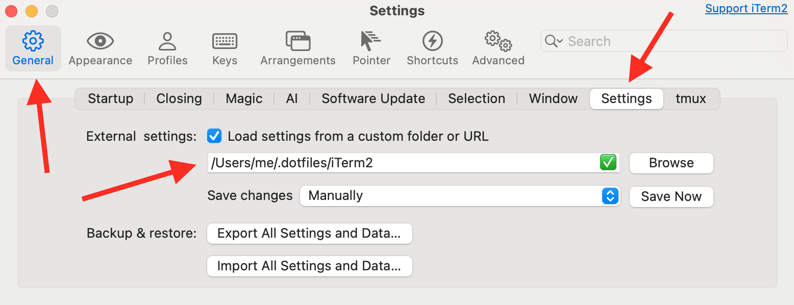

## Prerequisites

* macOS
* [Homebrew](http://brew.sh) package manager

## Installation

Clone to `~/.dotfiles`

## Shell Environment

### Zsh

```sh
ln -s ~/.dotfiles/.zshrc ~/.zshrc
```
Modified [oh-my-zsh](https://github.com/ohmyzsh/ohmyzsh) with [minimal prompt](https://github.com/sindresorhus/pure#pure).

## Terminal Emulators

### [iTerm2](http://iterm2.com)

```sh
brew install --cask iterm2
```
Point your preferences to `~/.dotfiles/iTerm2/com.googlecode.iterm2.plist`



### [Ghostty](https://ghostty.org/)

Fast cross-platform terminal emulator that uses platform-native UI and GPU acceleration.

```sh
brew install --cask ghostty
```
```sh
ln -s ~/.dotfiles/.config/ghostty ~/.config/ghostty
```

### [WezTerm](https://wezterm.org/)

```sh
brew install --cask wezterm
```
```sh
ln -s ~/.dotfiles/.config/wezterm ~/.config/wezterm
```

### [Warp](https://warp.dev/)

```sh
brew install --cask warp
```
```sh
ln -s ~/.dotfiles/.warp ~/.warp
```

## [Tmux](https://github.com/tmux/tmux/wiki)

```sh
brew install tmux
```

[Tmux Plugin Manager](https://github.com/tmux-plugins/tpm):
```sh
git clone https://github.com/tmux-plugins/tpm ~/.config/tmux/plugins/tpm
```
```sh
ln -s ~/.dotfiles/.config/tmux ~/.config/tmux
```
Start new session `tmux` and install plugins `prefix` + `I`, where prefix is `Ctrl` + `Space`

## Git

Put in `~/.gitconfig.local` sensitive information such as the `git` user credentials, e.g.:

```
[user]
    name = Denys Rafael
    email = denys@example.com
```

and then

```sh
ln -s ~/.dotfiles/.gitconfig ~/.gitconfig && ln -s ~/.dotfiles/.gitignore_global ~/.gitignore_global && ln -s ~/.dotfiles/.gitignore_global ~/.gitignore
```

In order to view all of my configured aliases enter `git aliases`

## Code Editors

### [NeoVim](https://neovim.io/)

```sh
brew install neovim
```

[Kickstart](https://github.com/nvim-lua/kickstart.nvim) based configuration:
```sh
ln -s ~/.dotfiles/.config/nvim ~/.config/nvim
```

### [Visual Studio Code](https://code.visualstudio.com/) and Forks

```sh
brew install --cask visual-studio-code
```

```sh
brew install --cask cursor
```

### [Zed](https://zed.dev/)

```sh
brew install --cask zed
```

```sh
mkdir -p $HOME/.config/zed && ln -s $HOME/.dotfiles/.config/zed/settings.json $HOME/.config/zed/settings.json
```

### [EditorConfig](https://editorconfig.org/)

```sh
brew install editorconfig
```

## Java Dev Tools

### OpenJDK

```sh
brew install openjdk@21
```
```sh
sudo ln -sfn $(brew --prefix)/opt/openjdk@21/libexec/openjdk.jdk /Library/Java/JavaVirtualMachines/openjdk-21.jdk
```

Set `JAVA_HOME` in `.zshrc` or `.bash_profile`:
```sh
if [ -x "$(command -v java)" ]; then
  export JAVA_HOME=$(/usr/libexec/java_home -v 21)
  export PATH=$JAVA_HOME/bin:$PATH
fi
```

### Java Build Tools

```sh
brew install ant maven gradle
```

### [IntelliJ IDEA](https://www.jetbrains.com/idea/)

```sh
brew install --cask intellij-idea
```

## Container Runtimes

### Docker and [Minikube](https://github.com/kubernetes/minikube)

```sh
brew install docker docker-compose minikube kubectl helm
```

### [Colima](https://github.com/abiosoft/colima)

```sh
brew install colima
```
Start container runtime: `colima start` or `colima start --kubernetes`.

### [Podman](https://podman.io/)

```sh
brew install podman podman-compose podman-desktop
```

## AI Coding Agents

### Installation

Prerequisites: `brew install node`

- [Claude Code](https://code.claude.com/docs/en/quickstart#step-1%3A-install-claude-code)
- [Pi Coding Agent](https://github.com/badlogic/pi-mono/tree/main/packages/coding-agent#quick-start)
- [OpenCode](https://opencode.ai/docs/#install)
- [Codex CLI](https://developers.openai.com/codex/quickstart?setup=cli)
- [Gemini CLI](https://geminicli.com/docs/get-started/installation/)
- [GitHub Copilot CLI](https://github.com/github/copilot-cli?tab=readme-ov-file#installation)

### Context Files 

```sh
ln -s ~/.dotfiles/.agents/AGENTS.md ~/.claude/CLAUDE.md
```
```sh
ln -s ~/.dotfiles/.agents/AGENTS.md ~/.pi/agent/AGENTS.md
```
```sh
ln -s ~/.dotfiles/.agents/AGENTS.md ~/.config/opencode/AGENTS.md
```
```sh
ln -s ~/.dotfiles/.agents/AGENTS.md ~/.codex/AGENTS.md
```
```sh
ln -s ~/.dotfiles/.agents/AGENTS.md ~/.gemini/GEMINI.md
```
```sh
ln -s ~/.dotfiles/.agents/AGENTS.md ~/.copilot/copilot-instructions.md
```

> [!NOTE]
> For more details, see [CLAUDE.md](https://code.claude.com/docs/en/memory), [Pi AGENTS.md](https://github.com/badlogic/pi-mono/tree/main/packages/coding-agent#context-files), [OpenCode AGENTS.md](https://opencode.ai/docs/rules/), [Codex AGENTS.md](https://developers.openai.com/codex/guides/agents-md), [GEMINI.md](https://geminicli.com/docs/cli/gemini-md/), and [copilot-instructions.md](https://docs.github.com/en/copilot/how-tos/configure-custom-instructions/add-personal-instructions)

### [Skills](https://agentskills.io/)

```sh
ln -s ~/.dotfiles/.agents/skills ~/.claude/skills
```
```sh
ln -s ~/.dotfiles/.agents/skills ~/.pi/agent/skills
```
```sh
ln -s ~/.dotfiles/.agents/skills ~/.config/opencode/skills
```
```sh
ln -s ~/.dotfiles/.agents/skills ~/.gemini/skills
```
```sh
# Codex, Copilot ~/.agents/skills/
ln -s ~/.dotfiles/.agents ~/.agents
```

### Configuration

```sh
ln -s ~/.dotfiles/.claude/settings.json ~/.claude/settings.json
```

> [!NOTE]
> For more details, see [Claude Code](https://code.claude.com/docs/en/settings), [pi-coding-agent](https://github.com/badlogic/pi-mono/blob/main/packages/coding-agent/docs/settings.md), [OpenCode](https://opencode.ai/docs/config/), [Codex](https://developers.openai.com/codex/config-basic), and [Gemini CLI](https://geminicli.com/docs/cli/settings/).


## See Also

* [GitHub does dotfiles](https://dotfiles.github.io/)
* [Awesome Awesomeness](https://github.com/bayandin/awesome-awesomeness): [Dotfiles](https://github.com/webpro/awesome-dotfiles), [Shell](https://github.com/alebcay/awesome-shell), [Dev Env](https://github.com/jondot/awesome-devenv), [Java](https://github.com/akullpp/awesome-java)
* [Command-Line Tools](share/INSTALL.md#command-line-tools)
* [Productivity Tips](share/PRODUCTIVITY.md)
