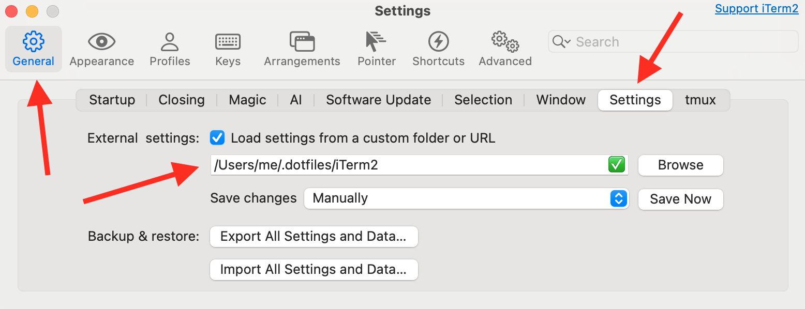

## Prerequisites

* macOS
* [Homebrew](http://brew.sh) package manager

## Installation

Clone to `~/.dotfiles`

## Shell Environment

### Zsh

```sh
ln -s ~/.dotfiles/.zshrc ~/.zshrc
```

### Shell Prompt

This dotfiles setup uses [Starship](https://starship.rs) (if installed) or [Pure](https://github.com/sindresorhus/pure#pure) as the shell prompt.

```sh
brew install starship
```

## Terminal Emulators

### [iTerm2](http://iterm2.com)

```sh
brew install --cask iterm2
```
Point your preferences to `~/.dotfiles/iTerm2/com.googlecode.iterm2.plist`



### [Ghostty](https://ghostty.org/)

Fast cross-platform terminal emulator that uses platform-native UI and GPU acceleration.

```sh
brew install --cask ghostty
```
```sh
ln -s ~/.dotfiles/.config/ghostty ~/.config/ghostty
```

### [WezTerm](https://wezterm.org/)

```sh
brew install --cask wezterm
```
```sh
ln -s ~/.dotfiles/.config/wezterm ~/.config/wezterm
```

### [Kitty](https://sw.kovidgoyal.net/kitty/)

GPU-based terminal emulator. Config is a 1:1 port of the Ghostty setup (Catppuccin Frappé, splits).

```sh
brew install --cask kitty
```
```sh
mkdir -p ~/.config/kitty && ln -sfn ~/.dotfiles/.config/kitty/kitty.conf ~/.config/kitty/kitty.conf
```

### [Warp](https://warp.dev/)

```sh
brew install --cask warp
```
```sh
ln -s ~/.dotfiles/.warp ~/.warp
```

## [Tmux](https://github.com/tmux/tmux/wiki)

The tmux configuration is plugin-free and supports tmux 3.3 or newer on macOS and Linux. It uses Catppuccin Frappé by default, includes a runtime Latte theme, integrates with Neovim and fzf, and copies selections to the local desktop clipboard.

### Install dependencies

On macOS:

```sh
brew install tmux fzf fd zoxide
```

On Ubuntu 24.04 or newer:

```sh
sudo apt install tmux fzf fd-find zoxide wl-clipboard
```

On Arch Linux:

```sh
sudo pacman -S tmux fzf fd zoxide wl-clipboard
```

`fzf` is required for the switcher and project launcher. `fd` and `zoxide` improve project discovery but are optional; the launcher falls back to `find`. For an X11 desktop, install `xclip` or `xsel` instead of `wl-clipboard`.

Check that the installed tmux meets the minimum version:

```sh
tmux -V
```

### Link the configuration

```sh
ln -sfn ~/.dotfiles/.config/tmux ~/.config/tmux
```

Tmux reads `~/.config/tmux/tmux.conf` automatically. No plugin manager or installation step is required.

If this replaces the previous TPM-based configuration, let existing sessions finish and restart the tmux server once. The following command closes every running tmux session, so do not run it until their work is saved:

```sh
tmux kill-server
```

Start or attach to a new session with:

```sh
tmux new-session -A -s main
```

### Key bindings

The prefix is `Ctrl-Space`.

| Binding | Action |
| --- | --- |
| `prefix`, `Ctrl-Space` | Send the prefix to a nested tmux session |
| `prefix`, `r` | Reload the complete configuration |
| `prefix`, `\|` | Split right in the active directory |
| `prefix`, `-` | Split below in the active directory |
| `prefix`, `c` | Create a window in the active directory |
| `prefix`, `x` | Close the current pane, with confirmation; closes the window when it is the last pane |
| `prefix`, `q` | Close the current pane immediately; closes the window when it is the last pane |
| `prefix`, `H/J/K/L` | Resize a tmux pane; repeat without pressing the prefix again |
| `Ctrl-h/j/k/l` | Navigate across Neovim splits and tmux panes |
| `Ctrl-Shift-h/j/k/l` | Resize Neovim splits or tmux panes |
| `prefix`, `z` | Zoom or restore the active pane |
| `prefix`, `f` | Search sessions, windows, and panes with fzf |
| `prefix`, `p` | Create or switch to a project session with fzf |
| `prefix`, `T` | Toggle Catppuccin Frappé and Latte |
| `prefix`, `S` | Cycle the status line through bottom, top, and hidden |
| `prefix`, `[` | Enter Vi-style copy mode |

In copy mode, press `v` to begin a selection, `Ctrl-v` to toggle a rectangle, and `y` to copy. Tmux writes the selection to its paste buffer and to the first available desktop provider: `pbcopy`, `wl-copy`, `xclip`, or `xsel`. OSC 52 clipboard support remains enabled for compatible terminals.

The status line shows the session, windows, and `user@host:~/current/path`. Theme and status-position changes apply to every client attached to the same tmux server and survive a configuration reload. They reset when the server exits; a new server starts with Frappé and a bottom status line.

### Configure project discovery

The project launcher combines zoxide's ranked directories with immediate child directories under configured roots. Set a colon-separated root list before starting tmux:

```sh
export TMUX_PROJECT_DIRS="$HOME/code:$HOME/src"
```

Without this variable, the launcher scans immediate children of `~/code` and `~/src` and includes `~/dotfiles` directly when those directories exist. If the tmux server is already running, update its environment with:

```sh
tmux set-environment -g TMUX_PROJECT_DIRS "$TMUX_PROJECT_DIRS"
```

### Terminal capabilities

Ghostty and Kitty keep their native `xterm-ghostty` and `xterm-kitty` values outside tmux. Applications inside tmux see `tmux-256color`. Do not force `TERM=xterm-256color`; doing so hides terminal capabilities that tmux uses for colors, keys, clipboard access, and hyperlinks.

When a remote host does not know the local terminal's terminfo entry, install it on that host. For example:

```sh
infocmp -x xterm-ghostty | ssh HOST 'tic -x -'
infocmp -x xterm-kitty | ssh HOST 'tic -x -'
```

The configuration enables `allow-passthrough` so trusted applications can use terminal graphics protocols through tmux. Passthrough also allows programs in visible panes to send wrapped escape sequences to the outer terminal. Do not run untrusted terminal applications in these panes.

If colors or modified keys are incorrect, confirm that `tmux-256color` exists with `infocmp tmux-256color` and that tmux is at least version 3.3. Tmux 3.5 or newer can emit CSI-u sequences for distinct `Ctrl-Shift` keys.

The setup follows the official [tmux manual](https://github.com/tmux/tmux/blob/master/tmux.1), the [fzf reference](https://junegunn.github.io/fzf/reference/), and the official [Catppuccin palette](https://github.com/catppuccin/catppuccin).

## Git

Put in `~/.gitconfig.local` sensitive information such as the `git` user credentials, e.g.:

```
[user]
    name = Denys Rafael
    email = denys@example.com
```

and then

```sh
ln -s ~/.dotfiles/.gitconfig ~/.gitconfig && ln -s ~/.dotfiles/.gitignore_global ~/.gitignore_global && ln -s ~/.dotfiles/.gitignore_global ~/.gitignore
```

In order to view all of my configured aliases enter `git aliases`

## Code Editors

### [NeoVim](https://neovim.io/)

```sh
brew install neovim
```

[Kickstart](https://github.com/nvim-lua/kickstart.nvim) based configuration:
```sh
ln -s ~/.dotfiles/.config/nvim ~/.config/nvim
```

### [Visual Studio Code](https://code.visualstudio.com/) and Forks

```sh
brew install --cask visual-studio-code
```

```sh
brew install --cask cursor
```

### [Zed](https://zed.dev/)

```sh
brew install --cask zed
```

```sh
mkdir -p $HOME/.config/zed && ln -s $HOME/.dotfiles/.config/zed/settings.json $HOME/.config/zed/settings.json
```

### [EditorConfig](https://editorconfig.org/)

```sh
brew install editorconfig
```

## Java Dev Tools

### OpenJDK

```sh
brew install openjdk@21
```
```sh
sudo ln -sfn $(brew --prefix)/opt/openjdk@21/libexec/openjdk.jdk /Library/Java/JavaVirtualMachines/openjdk-21.jdk
```

Set `JAVA_HOME` in `.zshrc` or `.bash_profile`:
```sh
if [ -x "$(command -v java)" ]; then
  export JAVA_HOME=$(/usr/libexec/java_home -v 21)
  export PATH=$JAVA_HOME/bin:$PATH
fi
```

### Java Build Tools

```sh
brew install ant maven gradle
```

### [IntelliJ IDEA](https://www.jetbrains.com/idea/)

```sh
brew install --cask intellij-idea
```

## Container Runtimes

### Docker and [Minikube](https://github.com/kubernetes/minikube)

```sh
brew install docker docker-compose minikube kubectl helm
```

### [Colima](https://github.com/abiosoft/colima)

```sh
brew install colima
```
Start container runtime: `colima start` or `colima start --kubernetes`.

### [Podman](https://podman.io/)

```sh
brew install podman podman-compose podman-desktop
```

## AI Coding Agents

My AI coding-agent setup now lives in a separate repository: [drafael/coding-harness](https://github.com/drafael/coding-harness).

## See Also

* [GitHub does dotfiles](https://dotfiles.github.io/)
* [Awesome Awesomeness](https://github.com/bayandin/awesome-awesomeness): [Dotfiles](https://github.com/webpro/awesome-dotfiles), [Shell](https://github.com/alebcay/awesome-shell), [Dev Env](https://github.com/jondot/awesome-devenv), [Java](https://github.com/akullpp/awesome-java)
* [Command-Line Tools](share/INSTALL.md#command-line-tools)
* [Productivity Tips](share/PRODUCTIVITY.md)
