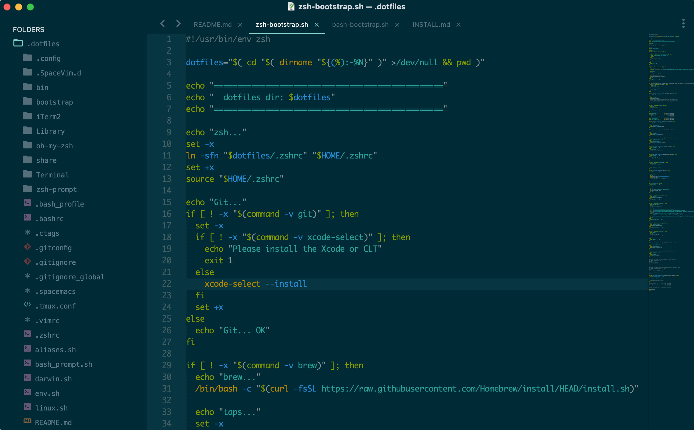
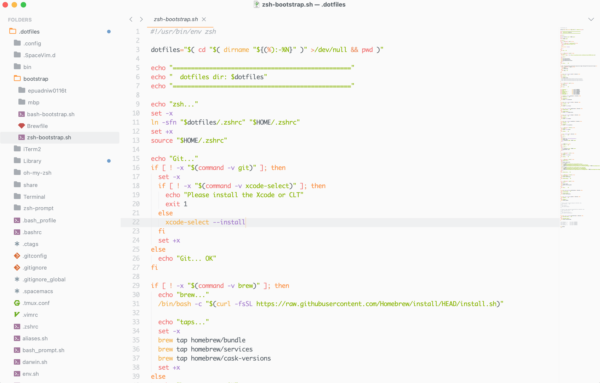

## Prerequisites

* macOS
* Command Line Tools (CLT) for Xcode: `xcode-select --install`
* A Bourne-compatible shell for installation (e.g. bash or zsh)
* [Homebrew](http://brew.sh) package manager.

## Vim

* Upgrading:

```sh
brew install vim && brew link --overwrite vim
```


* [MacVim](http://macvim-dev.github.io/macvim) installation:

```sh
brew install --cask macvim
```
```sh
defaults write org.vim.MacVim MMTitlebarAppearsTransparent true
```

* Syncing [.vimrc](https://github.com/drafael/dotfiles/blob/master/.vimrc):

```sh
ln -s ~/.dotfiles/.vimrc ~/.vimrc && vim +PluginInstall +qall
```

* [NeoVim](https://neovim.io):

```sh
ln -s ~/.dotfiles/.config/nvim/init.vim ~/.config/nvim/init.vim && brew install neovim
```

* [Tagbar](https://github.com/majutsushi/tagbar#tagbar-a-class-outline-viewer-for-vim) dependencies installation:

```sh
ln -s ~/.dotfiles/.ctags ~/.ctags && brew install ctags gotags
```

#### My Favorite VIM Plugins

  - [x] [Vundle](https://github.com/VundleVim/Vundle.vim#about) — plugin manager
  - [x] [Airline](https://github.com/vim-airline/vim-airline#vim-airline-) — status bar
  - [x] [vim-colors-solarized](https://github.com/altercation/vim-colors-solarized#screenshots), [PaperColor Theme](https://github.com/nlknguyen/papercolor-theme#screenshots), and [Ayu](https://github.com/ayu-theme/ayu-vim)
  - [x] [CtrlP](https://github.com/ctrlpvim/ctrlp.vim#ctrlpvim) — fuzzy file finder, buffer switcher, MRU
  - [x] [Auto Pairs](https://github.com/jiangmiao/auto-pairs#auto-pairs) — insert or delete brackets, parens, quotes in pair
  - [x] [Snipmate](https://github.com/garbas/vim-snipmate#snipmate) — [Snippet](https://github.com/honza/vim-snippets#snipmate--ultisnip-snippets) manager for vim
  - [x] [Syntastic](https://github.com/vim-syntastic/syntastic) — syntax checking hacks for vim
  - [x] [Tagbar](https://github.com/majutsushi/tagbar#tagbar-a-class-outline-viewer-for-vim) — plugin that displays tags in a window, ordered by scope
  - [x] [vim-polyglot](https://github.com/sheerun/vim-polyglot#vim-polyglot--) — meta-plugin for syntaxes
  - [x] [vim-rooter](https://github.com/airblade/vim-rooter#rooter) — changes working directory to project root
  - [x] [vim-better-whitespace](https://github.com/ntpeters/vim-better-whitespace#vim-better-whitespace-plugin) — better whitespace highlighting
  - [x] [indentLine](https://github.com/Yggdroot/indentLine#indentline) — display the indention levels with thin vertical lines
  - [x] [vim-session](https://github.com/xolox/vim-session#extended-session-management-for-vim) — extended session management for Vim

#### Also Take a Look

- [Vim Awesome](http://vimawesome.com/)
- [Awesome Vim Color Schemes](https://github.com/rafi/awesome-vim-colorschemes#awesome-vim-color-schemes)
- [Vim Colors](http://vimcolors.com/)
- [SpaceVim](https://spacevim.org/)
- [Tagbar Wiki](https://github.com/majutsushi/tagbar/wiki)

## Command-Line Tools

```bash
brew install ack ag htop mc ncdu neovim nmap peco pt ranger ripgrep ssh-copy-id tree tig tmux tree wget
```

* [ack](http://beyondgrep.com) — a code-searching tool like `grep`, optimized for programmers
* [ag](https://github.com/ggreer/the_silver_searcher) — a code searching tool similar to `ack`, with a focus on speed
* [bash-completion](https://github.com/scop/bash-completion) — Programmable completion functions for bash
* [editorconfig](https://editorconfig.org/) — helps define and maintain consistent coding styles between different editors and IDEs
* [htop](https://hisham.hm/htop/) — improved top (interactive process viewer)
* [httpie](https://httpie.org/) — is a command line HTTP client
* [mc](https://midnight-commander.org/) — terminal-based visual file manager
* [ncdu](https://dev.yorhel.nl/ncdu) — is a disk usage analyzer with an ncurses interface
* [nmap](https://nmap.org/) — port scanning utility for large networks
* [peco](https://github.com/peco/peco) — simplistic interactive filtering tool
* [pt](https://github.com/monochromegane/the_platinum_searcher#the-platinum-searcher--) — a code search tool similar to `ack`, `ag`, `rg`
* [ranger](https://ranger.github.io/) — a console file manager with `vi` key bindings
* [ripgrep (rg)](https://github.com/BurntSushi/ripgrep#ripgrep-rg) — a line-oriented search tool that recursively searches your current directory for a regex pattern
* [tree](http://mama.indstate.edu/users/ice/tree/) — recursive directory listing command that produces a depth indented listing of files
* [tig](http://jonas.nitro.dk/tig/) — ncurses-based text-mode interface for `git`
* [tmux](http://tmux.github.io) — a terminal multiplexer
* [tree](http://mama.indstate.edu/users/ice/tree/) — display directories as trees


## [Sublime Text](https://www.sublimetext.com/)

Installation `brew install sublime-text` and configuration (Sublime Text 3):

[Package Control](https://packagecontrol.io/) — the first thing to do after the ST installation is to setup the package manager
* [Installation](https://packagecontrol.io/installation) (manual)
```bash
cd ~/Library/Application\ Support/Sublime\ Text\ 3/
rm -r Installed\ Packages/
ln -s ~/.dotfiles/Library/Application\ Support/Sublime\ Text\ 3/Installed\ Packages/
```
* [Syncing](https://packagecontrol.io/docs/syncing)
```bash
cd ~/Library/Application\ Support/Sublime\ Text\ 3/Packages/
rm -r User
ln -s ~/.dotfiles/Library/Application\ Support/Sublime\ Text\ 3/Packages/User/
```

Also take a look awesome [Quick Start Guides](https://github.com/dreikanter/sublime-bookmarks).

* Material [Solarized Dark](https://github.com/altercation/solarized) theme:


* Material [Ayu Light](https://github.com/dempfi/ayu) theme:

